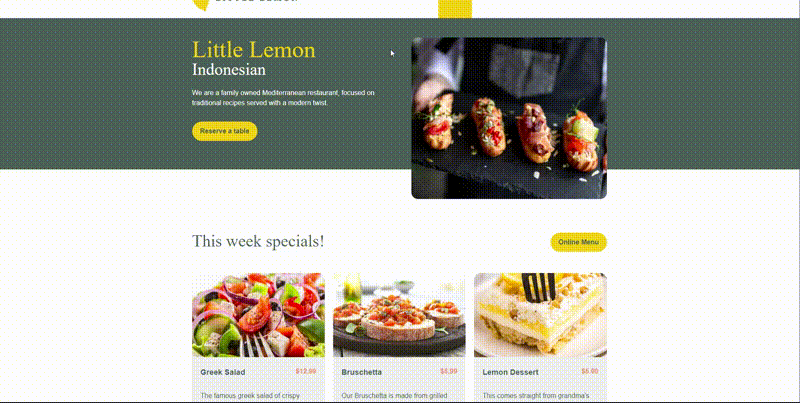

<h1 align="center">Little Lemon</h1>

<p align="center">This project is a website that displays a Little Lemon for Front-End Developer Capstone</p>

---

<br>

### Detail

<h1 align="center">
  
  
</h1>

## 📱 Features

- Create a layout using CSS
- Responsive website
- Built with React.js & FontAwesome

## 🚀 Technologies & Resources

- [x] [React](https://react.dev/)

## 💻 Installation

1. #### Clone the repository:

   ```bash
   git clone https://github.com/fadhildwia/little-lemon.git
   ```

2. #### Navigate to the project directory:

   ```bash
   cd little-lemon
   ```

3. #### Install the dependencies:

   ```bash
   npm install
   ```

4. #### Run the project:
   ```bash
   npm run start
   ```

<!-- ## License

This example application is licensed under the [MIT License](LICENSE).

--- -->

---

Feel free to explore the code and adapt it to suit your needs! If you encounter any issues or have suggestions for improvements, please don't hesitate to open an issue or submit a pull request.
